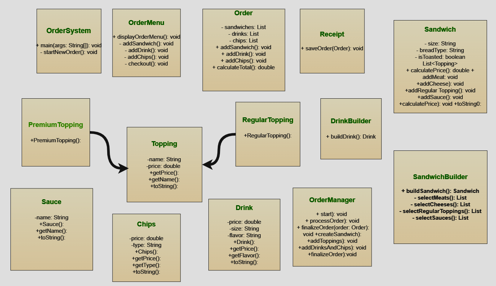

# Project Title

Deli-cious Order System

## Description of the Project

The Deli-cious Order System is a simple app that lets users order sandwiches,
drinks, and chips. Users can choose sandwich size, bread type, toppings, sauces,
drink flavors, and chip types to customize their order.

The system shows the total price and provides an order summary before finalizing.
After placing an order, users get a receipt with all items and costs.
This app is great for small restaurants to make order-taking fast and easy.

## User Stories

- As a user, I want to be able to pick between items like sandwich, drink,
  and chips so that I can customize my order with the available options.

- As a user, I want to choose a sandwich size (4-inch, 8-inch, 12-inch)
  so that I can control the portion of my meal.

- As a user, I want to select the type of bread for my sandwich (white, wheat, rye, wrap)
  so that I can enjoy my preferred flavor and texture.

- As a user, I want an option to have my sandwich toasted or not so
  that I can customize the texture.

- As a user, I want to select a type of drink (Cola, Lemonade, Orange, Water)
  so that I can have my preferred beverage with my meal.

- As a user, I want to choose the size of my drink (Small, Medium, Large) so
  that I can have the right amount of beverage.

- As a user, I want to choose my chips flavor (Plain, BBQ, Sour Cream)
  so that I can enjoy my preferred snack with my meal.

- As a user, I want to be able to add meat toppings to my sandwich,
  such as steak or chicken, so that I can have my favorite protein options.

- As a user, I want to add cheese toppings to my sandwich, such as cheddar or
  provolone, so that I can enhance the flavor of my sandwich.

- As a user, I want to choose regular toppings like lettuce, tomatoes, and onions so
  that I can customize my sandwich with my preferred vegetables.

- As a user, I want to choose sauces (Ketchup, Mayonnaise, Mustard, BBQ)
  to add to my sandwich so that I can have additional flavors.

- As a user, I want to see the total price of my order
  so that I know how much I’m spending.

- As a user, I want to be able to review my entire order before finalizing it
  so that I can ensure accuracy.

- As a user, I want to be able to remove an item from my order so that
  I can make changes if needed.

- As a user, I want to receive a receipt with my order details and total cost
  so that I have a record of my purchase.

## Setup

Instructions on how to set up and run the project using IntelliJ IDEA.

### Prerequisites

- IntelliJ IDEA: Ensure you have IntelliJ IDEA installed, which you can download
  from [here](https://www.jetbrains.com/idea/download/).
- Java SDK: Make sure Java SDK is installed and configured in IntelliJ.

### Running the Application in IntelliJ

Follow these steps to get your application running within IntelliJ IDEA:

1. Open IntelliJ IDEA.
2. Select "Open" and navigate to the directory where you cloned or downloaded the project.
3. After the project opens, wait for IntelliJ to index the files and set up the project.
4. Locate the Program class with the public static void main(String[] args) method.
5. Right-click on the Program class and select 'Run' to start the application.

## Technologies Used

- Java: Mention the version you are using.
- Any additional libraries or frameworks used in the project.

## Demo

## Future Work

- Add Payment Options
  Integrate payment methods like cash, card, or digital payments.

## Resources

- https://yearup.brightspace.com/d2l/home
- https://www.google.com/

## Team Members

- Enes Yilmaz

## Thanks

- Thank you to Raymond for continuous support and guidance.
- A special thanks to Taha bilmen for their dedication and teamwork.